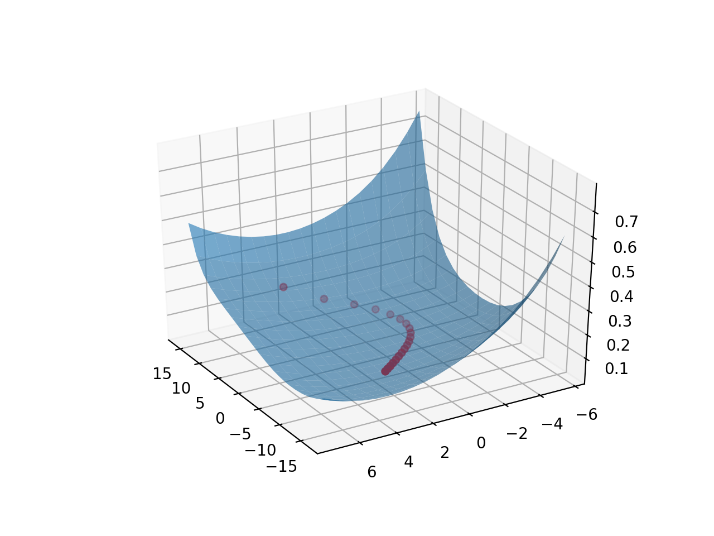

# Neural Network from scratch
Created for Machine Learning class at WPI.  
Implemented a neural network from scratch that trains on the mnist data set.  
Created a hyperparamter optimization algorithm that optimizes each hyperparamter individually and combines then together.  
### Achieves 95% accuracy after 1 epoch, and 97% after 30 epochs.
## Visualization of the training using PCA.
Blue surface is the training waits from an inverse transform of 2 value PCA.  
Red dots are the approximated neural network weights array.  
The Z dimension is the cross entropy loss.
